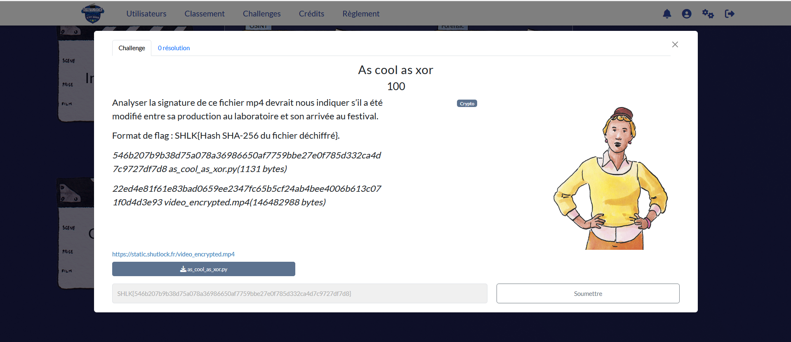
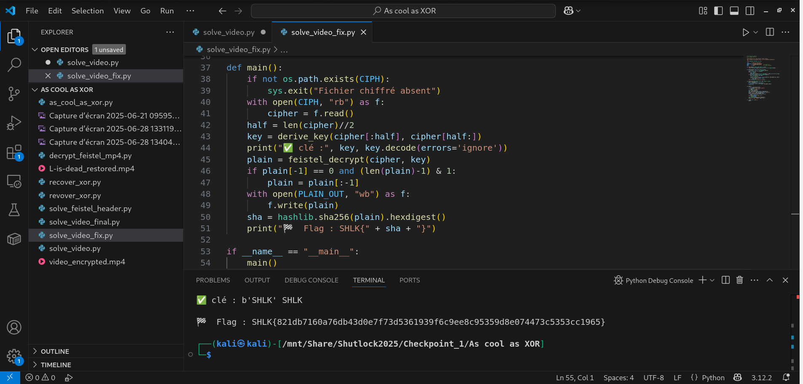
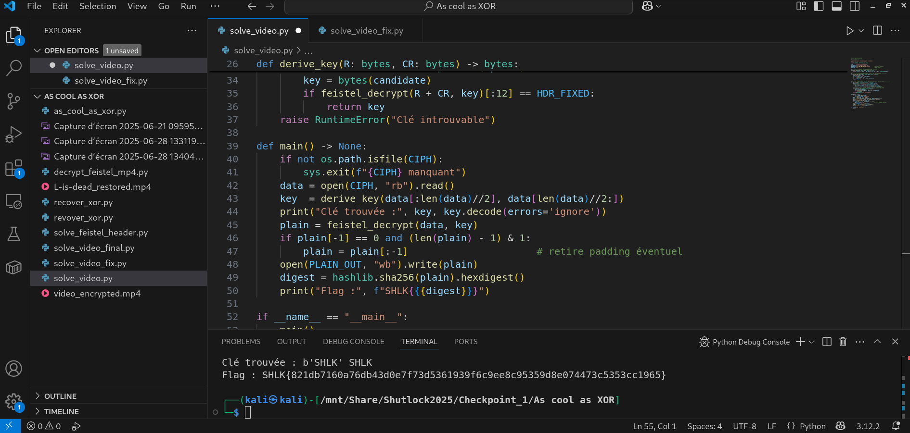
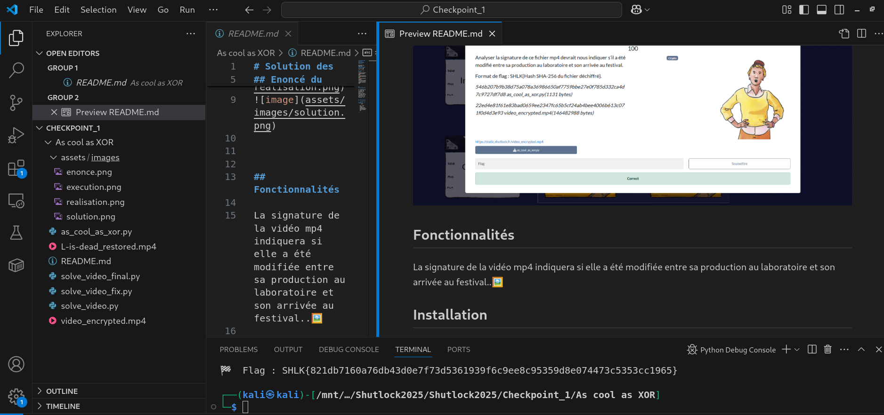
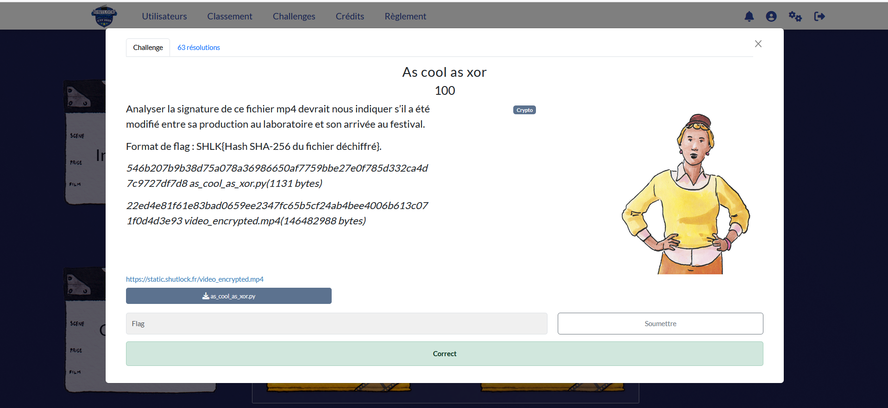

# Solution des défis du Shutlock2025 édition 2

Bienvenue au dépôt de **Shutlock2025 éd. 2** : As cool as XOR.

## Enoncé du sujet







## Fonctionnalités

La signature de la vidéo mp4 indiquera si elle a été modifiée entre sa production au laboratoire et son arrivée au festival..🖼️ 

## Principe math
Fonction F linéaire :


$$F[i] \;=\; R[i] \,\cdot\, k_{\,i \bmod 4} \pmod{256}$$

Pour chaque \(i\), on résout l’équation :

$$
R_i \,\cdot\, k_{\,i \bmod 4} \;\equiv\; F_i \pmod{256}
$$
Clé sur quatre octets :


$$k \;=\; [\,0x53,\; 0x48,\; 0x4C,\; 0x4B\,] 
  \;=\; (\text{"S"},\; \text{"H"},\; \text{"L"},\; \text{"K"})$$
Inversion d’un tour de réseau de Feistel :

$$\begin{cases}
L \;\leftarrow\; C_R \;\oplus\; F\!\left(C_L\right) \\
R \;\leftarrow\; C_L
\end{cases}$$

## Installation

1. **Cloner le dépôt** :
   ```bash

   git clone https://github.com/JackeOLantern/Shutlock2025.git

...
