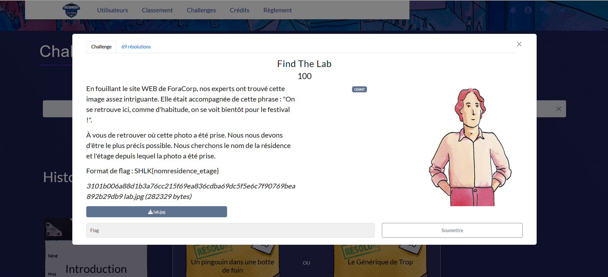
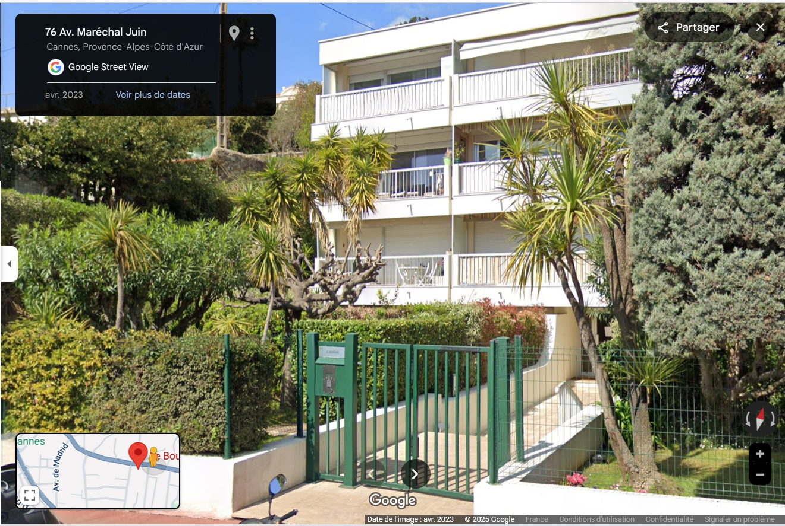
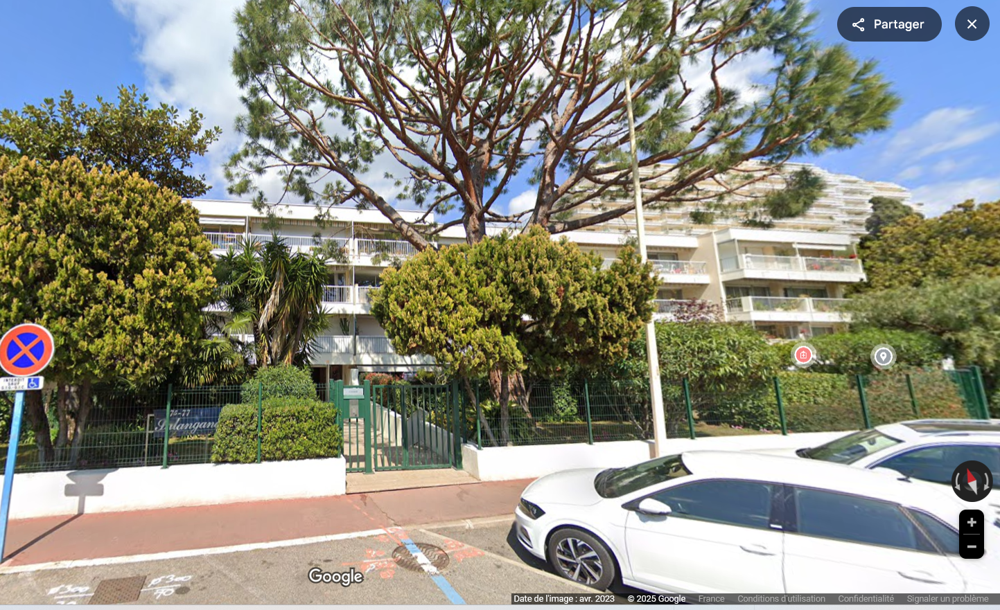
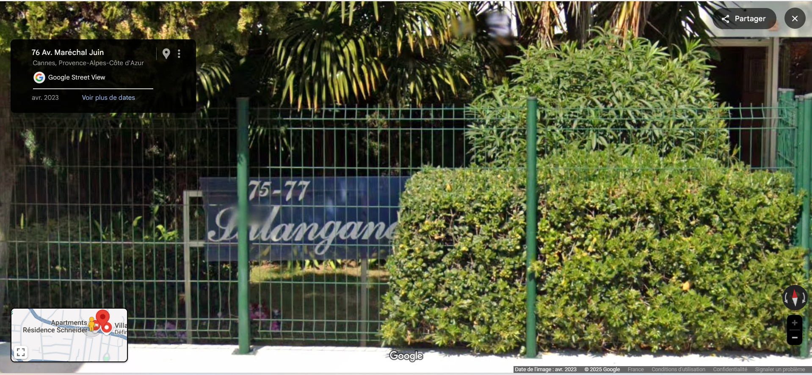
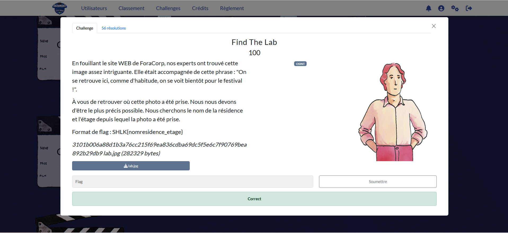

# Solution des défis du Shutlock2025 édition 2

Bienvenue au dépôt de **Shutlock2025 éd. 2** : Find The Lab.

## Enoncé du sujet










## Fonctionnalités
A l'aide d'une photo, il est requis de chercher d'où une photo a été prise. S'appuyant sur des outils tels Google Maps et Google Street View, zooms à travers les positions des rues afin par recoupement de retrouver la résidence et l'étage depuis la prise de vue.
Le sujet est bien d'OSINT.🖼️ 

## Installation

1. **Cloner le dépôt** :
   ```bash

   git clone https://github.com/JackeOLantern/Shutlock2025.git

...
