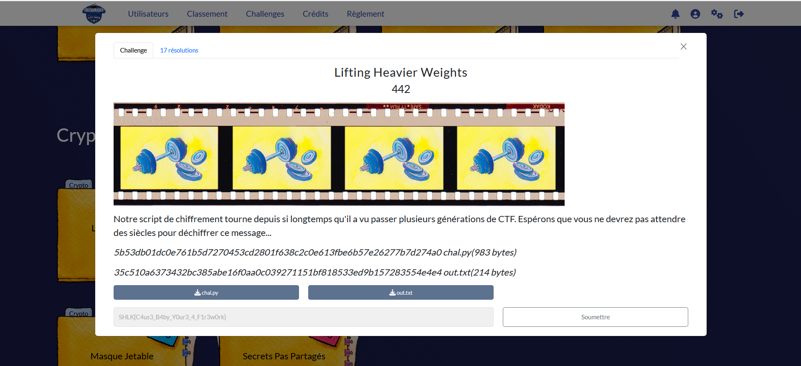
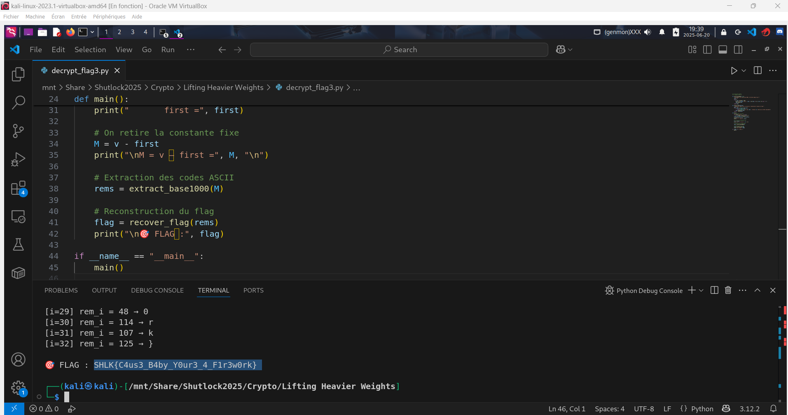
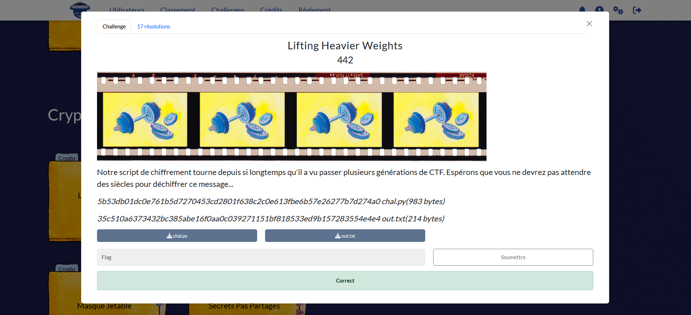

# Solution des défis du Shutlock2025 édition 2

Bienvenue dans le dépôt de **Shutlock2025**.

## Enoncé du sujet





## Fonctionnalités

- **La résolution de Lifting Heavier Weights fait appel lemme de Lifting The Exponent qui garantit une structure p-adique du chiffrement** : README et Lifting Heavier Weights (Fichier PDF).🖼️ 

## Fonctionnalités

- **La solution expliquée** : Lifting_Heavier_Weights (Fichier PDF).

## Principe math
## 🧮 Extraction de l’octet via LTE

 

➡️ **On obtient** :

On a  
$$x \equiv y \pmod p \;\Longrightarrow\;p \mid (x-y);\$$  
$\nu_{p}\bigl(x^{n}-y^{n}\bigr)=\nu_{p}(x-y)+\nu_{p}(n)$

$$
\nu_{p}(n)=\text{byte}\times\text{big\\_big\\_big}
$$

$$
\text{big\\_big\\_big}=1000^{\,i}
$$

Finalement :

$$
v=\sum_{i}\bigl(\text{byte}_{i}\times1000^{i}\bigr)
$$

## Installation

1. **Cloner le dépôt** :
   ```bash

   git clone https://github.com/JackeOLantern/Shutlock2025.git

...
