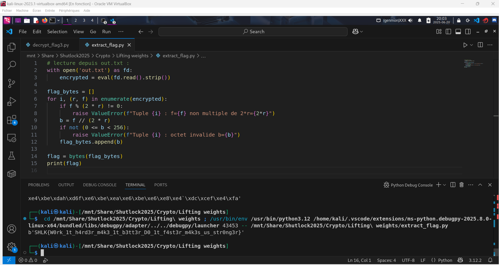

# Solution des défis du Shutlock2025 édition 2

Bienvenue dans le dépôt de **Shutlock2025**.

## Enoncé du sujet




## Fonctionnalités

- **La résolution de Lifting Weights fait appel au lemme de LTE ou Manea qui donne des formules pour calculer la valuation p-adique ${\displaystyle \nu _{p}}$ de certaines expressions entières et qui est applicable aux courbes elliptiques** : ReadMe.md et Lifting Weights (Fichier PDF).🖼️ 

## Principe math
## 🧮 Extraction de l’octet via LTE

Pour chaque tuple $(r, f)$, la relation suivante est **exacte** :

$$
f = f(t) = \nu_{2}(x^n - y^n) = r \cdot b
$$

grâce au **lemme du relèvement des exposants (LTE)** appliqué à :$(p = 2)$

$$
\nu_{2}(x^n - y^n) = \nu_{2}(x - y) + \nu_{2}(n),
$$

où  :

- $`n = 2^{r b}`$
- $`x - y = n`$


démontrant que les autres facteurs n’apportent rien à la valuation.  

➡️ **Donc** :

$$
b = \frac{f}{r}.
$$

## Installation

1. **Cloner le dépôt** :
   ```bash

   git clone https://github.com/JackeOLantern/Shutlock2025.git

...
