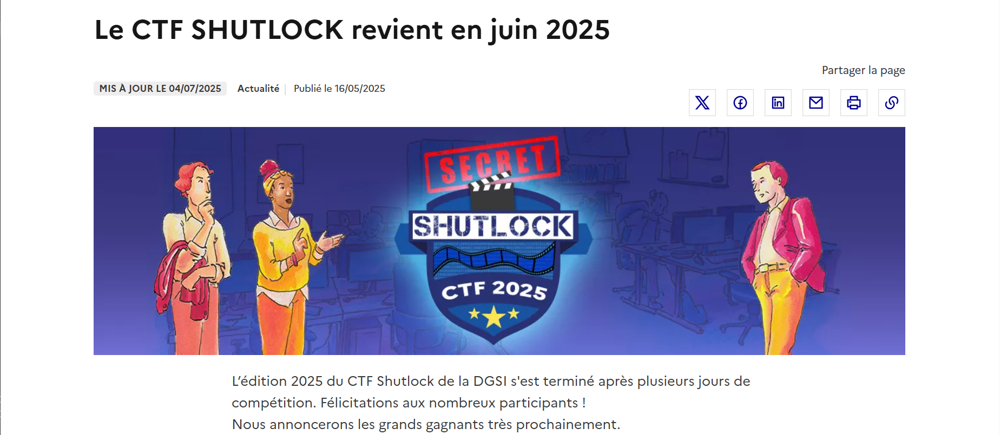
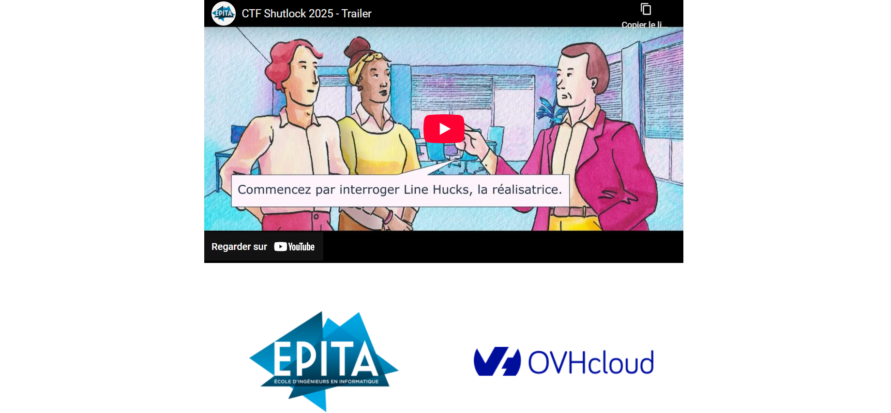

# Solution des défis du Shutlock2025 édition 2

Bienvenue dans le dépôt de **Shutlock2025 éd. 2**.

## Enoncé du sujet




## Fonctionnalités

La résolution (arrêt-solution) en dossier courant (court rend) des mots (démos) : README et mon Thème (PDF).🖼️ 


## Installation

1. **Cloner le dépôt** :
   ```bash

   git clone https://github.com/JackeOLantern/Shutlock2025.git

...
