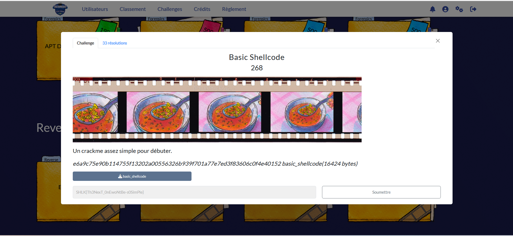
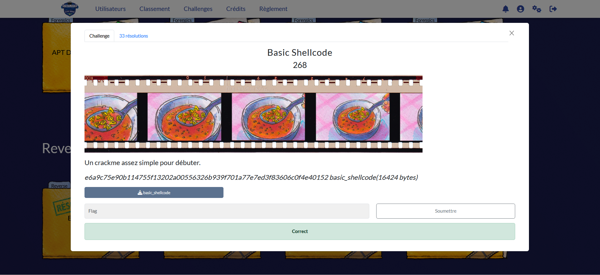

# Solution des défis du Shutlock2025 édition 2 : Basic Shellcode
Bienvenue dans le dépôt de **Shutlock2025**.

## Enoncé du sujet




## Fonctionnalités

- **La résolution de Basic Shellcode fait appel à l'investigation du binaire** : ReadMe.md et Basic Shellcode (Fichier PDF).🖼️ 


## Fonctionnalités

- **La solution expliquée** : Basic Shellcode (Fichier PDF).

## Principe math
## 🧮 Extraction de l’octet viaparcours du  binaire

Extraire KEY et SECRET dans check() et écrire l’équation XOR.

Déduire le buffer de 32 octets attendu. Analyser le shellcode : 

il réarrange votre saisie avec la permutation : $(7·i) mod 32$

La permutation (multiplier l’indice par 23) reste à inverser.

Si le message affiche “ This is the right flag! ”, c’est gagné.


## Installation

1. **Cloner le dépôt** :
   ```bash

   git clone https://github.com/JackeOLantern/Shutlock2025.git

...
