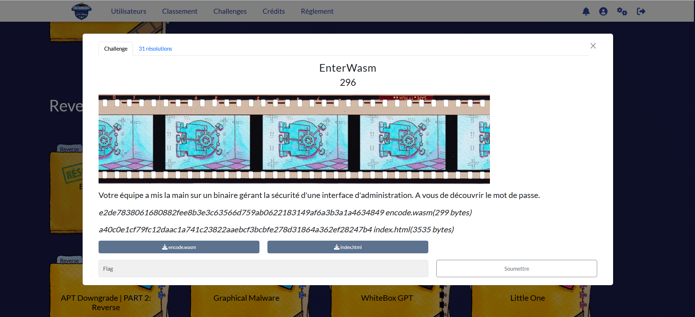
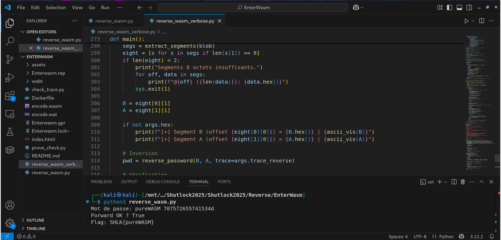
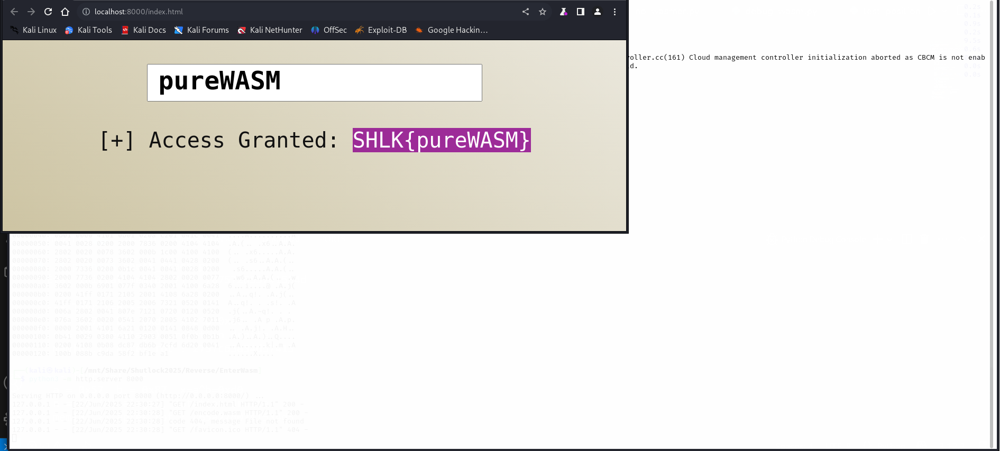
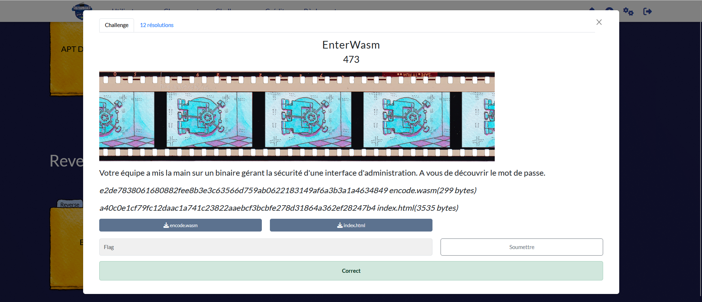

# Solution des défis du Shutlock2025 édition 2 : EterWasm et index (navigateur)
Bienvenue dans le dépôt de **Shutlock2025**.

## Enoncé du sujet






## Fonctionnalités

- **La résolution de EnterWasm fait appel à l'investigation du binaire sous Ghidra et de l'explicatif ** : ReadMe.md et EnterWASM (Fichier PDF).🖼️ 
- Depuis : EnterWasm
- avec : index.html
- 

## Fonctionnalités

- **La solution expliquée** : EnterWasm (Fichier PDF).

## Principe math
## 🧮 Déchiffrement du mot de passe en drapeau via parcours du binaire assmebleur d'entrée


## Installation

1. **Cloner le dépôt** :
   ```bash

   git clone https://github.com/JackeOLantern/Shutlock2025.git

...
