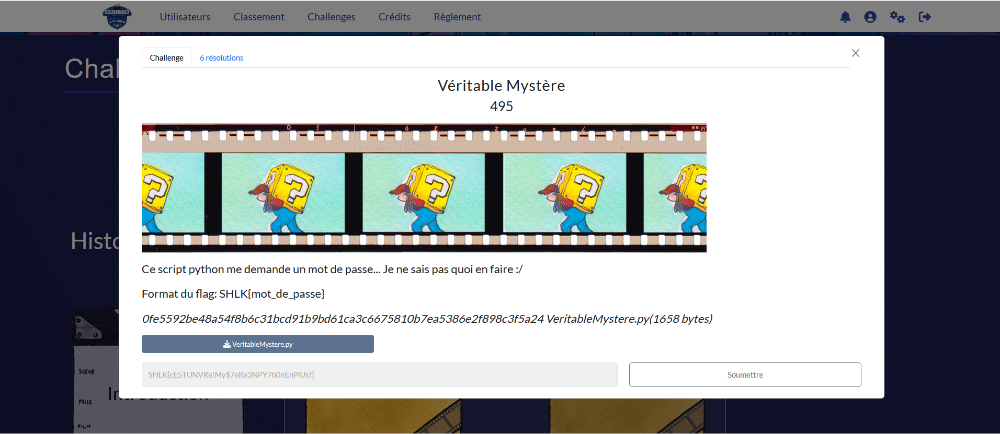
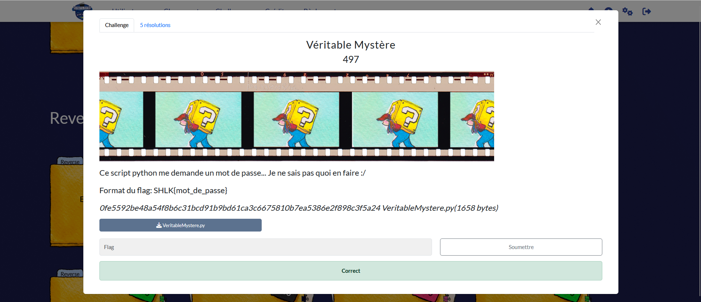

# Solution des défis du Shutlock2025 édition 2 : Véritable Mystère
Bienvenue dans le dépôt de **Shutlock2025**.

## Enoncé du sujet





## Fonctionnalités

- **La résolution de Véritable Mystère fait appelau diagnostic du script *PY et de l'explicatif ** : ReadMe.md et Veritable_Mystere (Fichier PDF).🖼️ 
- Depuis : VeritableMystere.py
- Vers : solve_flag.py

## Fonctionnalités

- **La solution expliquée** : Veritable_Mystere (Fichier PDF).

## Principe math
## 🧮 Déchiffrement du mot de passe en drapeau via parcours du  script d'entrée

$ python3 solve_flag.py VeritableMystere.py -r
[+] Mot de passe trouvé : cE5TUNVRa!My$7eRe3NPY7h0nEnPlUs!

[•] Vérification dans le binaire original :
Mot de passe valide !

🏁Le flag final est obtenu : SHLK{cE5TUNVRa!My$7eRe3NPY7h0nEnPlUs}


## Installation

1. **Cloner le dépôt** :
   ```bash

   git clone https://github.com/JackeOLantern/Shutlock2025.git

...
